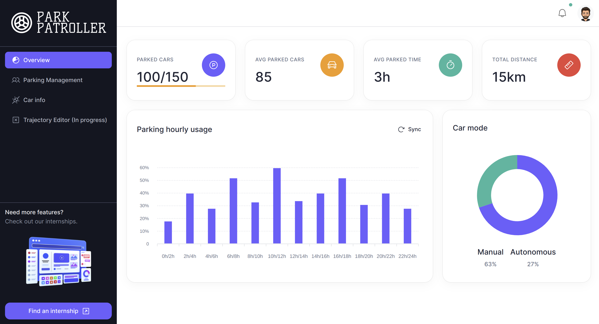
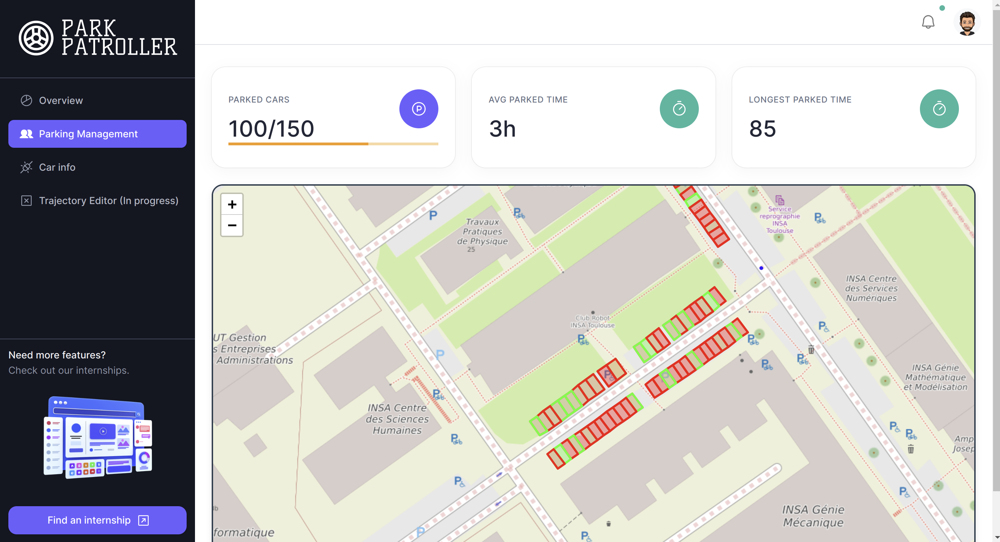

## Parking Management website




> The Overview page shows a dashboard of the car and parking information



> The Parking Management page shows all the necessary information for the parking management


> The Car Information page shows the status of the vehicle


## Quick start

- Clone the repo
- Make sure your Node.js and npm versions are up to date
- Move to this directory
- Install dependencies: `npm install` or `yarn`
- Start the server: `npm run dev` or `yarn dev`
- Open browser: `http://localhost:3000`

## To deploy on server

- Install nodejs
- Install serve (node)
- Install pm2 (node)
- Install nginx

- Build: `npx vite build`
- Serve: `npx pm2 start serve --name "geicar" -- dist 3456`
- Save and set to startup: `npx pm2 save` `npx pm2 startup`
- Set up nginx server:
```nginx
server {
    server_name srv665994.hstgr.cloud;

    location / {
        proxy_pass http://localhost:3456;
        proxy_http_version 1.1;
        proxy_set_header Upgrade $http_upgrade;
        proxy_set_header Connection 'upgrade';
        proxy_set_header Host $host;
        proxy_cache_bypass $http_upgrade;
    }

    listen 443 ssl; # managed by Certbot
    ssl_certificate /etc/letsencrypt/live/srv665994.hstgr.cloud/fullchain.pem; # managed by Certbot
    ssl_certificate_key /etc/letsencrypt/live/srv665994.hstgr.cloud/privkey.pem; # managed by Certbot
    include /etc/letsencrypt/options-ssl-nginx.conf; # managed by Certbot
    ssl_dhparam /etc/letsencrypt/ssl-dhparams.pem; # managed by Certbot

}
server {
    if ($host = srv665994.hstgr.cloud) {
        return 301 https://$host$request_uri;
    } # managed by Certbot

    location / {
        proxy_pass http://localhost:3456;
        proxy_http_version 1.1;
        proxy_set_header Upgrade $http_upgrade;
        proxy_set_header Connection 'upgrade';
        proxy_set_header Host $host;
        proxy_cache_bypass $http_upgrade;

    }
    listen 80;
    server_name srv665994.hstgr.cloud;
    server_name 147.79.101.94;
    #return 404; # managed by Certbot
}
```
- Add HTTPS with Let's Encrypt `sudo apt install certbot python3-certbot-nginx` `sudo certbot --nginx -d yourdomain.com`
- Enable the site `sudo ln -s /etc/nginx/sites-available/geicar /etc/nginx/sites-enabled/`
- Set up Mosquitto `sudo apt install mosquitto mosquitto-clients`  `sudo nano /etc/mosquitto/mosquitto.conf`
```conf
# Place your local configuration in /etc/mosquitto/conf.d/
#
# A full description of the configuration file is at
# /usr/share/doc/mosquitto/examples/mosquitto.conf.example
#user root
per_listener_settings true

pid_file /var/run/mosquitto/mosquitto.pid

persistence true
persistence_location /var/lib/mosquitto/

log_dest file /var/log/mosquitto/mosquitto.log

include_dir /etc/mosquitto/conf.d

listener 1883
allow_anonymous false
password_file /etc/mosquitto/passwd


listener 9001
protocol websockets
allow_anonymous true
password_file /etc/mosquitto/passwd
# Added for wss
#certfile /etc/mosquitto/certs/fullchain.pem
#keyfile /etc/mosquitto/certs/privkey.pem
#require_certificate true
```
- Test that it works, have fun

## Reporting Issues:

- [Github Issues Page](https://github.com/BloodFutur/geicar/issues)

## License

- Licensed under [MIT](./LICENSE.md)

## Contact Us

- Email Us: rbonnet@insa-toulouse.fr
