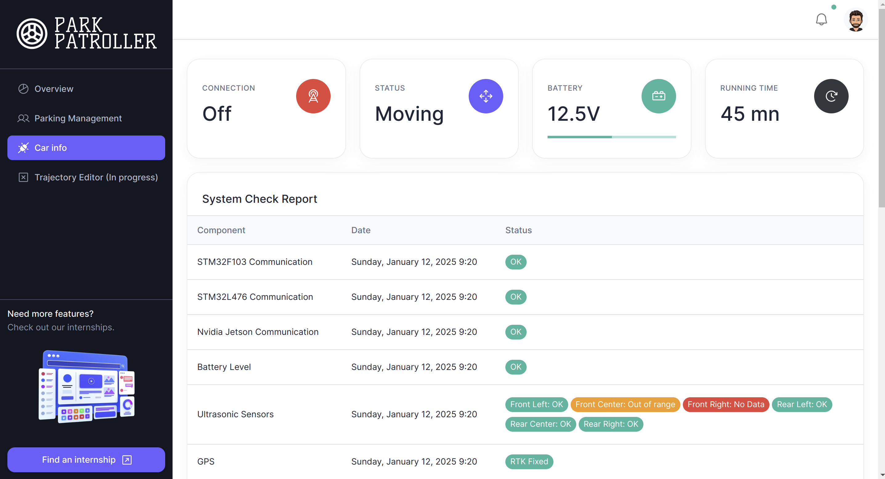

## Parking Management website

> The Overview page shows a dashboard of the car and parking information

> The Parking Management page shows all the necessary information for the parking management

> The Car Information page shows the status of the vehicle

## Quick start

- Clone the repo
- Make sure your Node.js and npm versions are up to date
- Move to this directory
- Install dependencies: `npm install` or `yarn`
- Start the server: `npm run dev` or `yarn dev`
- Open browser: `http://localhost:3000`

## Reporting Issues:

- [Github Issues Page](https://github.com/BloodFutur/geicar/issues)

## License

- Licensed under [MIT](./LICENSE.md)

## Contact Us

- Email Us: rbonnet@insa-toulouse.fr
